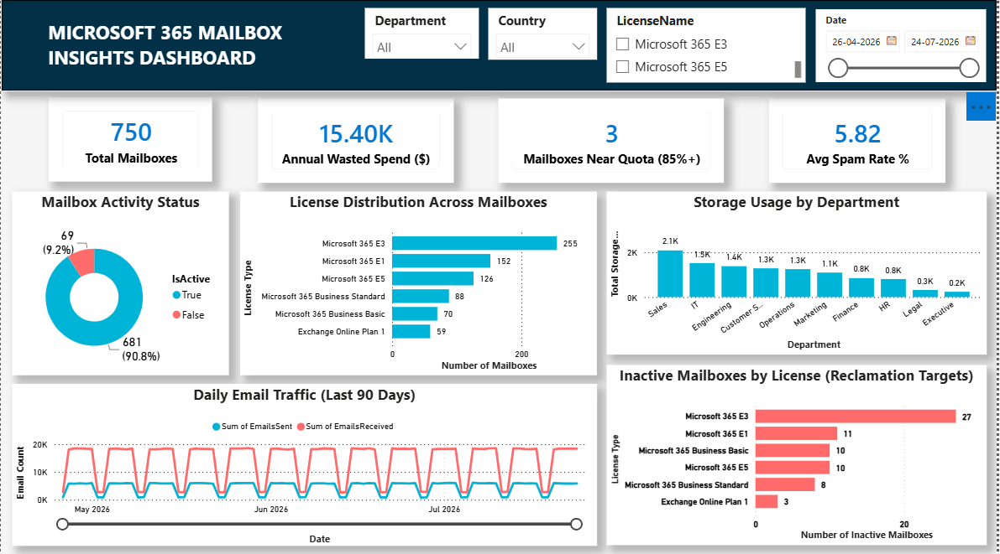

# M365 Mailbox Insights Dashboard

Interactive Power BI dashboard analyzing Exchange Online mailbox storage, license utilization, and mail-flow health for Microsoft 365 operations — built to surface concrete cost-saving and risk-reduction opportunities for IT administrators.

**Stack:** SQL Server / Oracle SQL · Python (pandas, NumPy, Matplotlib) · Power BI

---

## 📌 The Problem

Organizations running Microsoft 365 at scale often lack visibility into Exchange Online mailbox health — leading to unmonitored storage growth, licenses paid for on inactive accounts, and no early warning before mailboxes hit quota and start bouncing mail.

## 💡 Key Finding

**69 of 750 mailboxes (9.2%) had no logon in 90+ days while still carrying an active license — an estimated $15,400/year in reclaimable spend.** Microsoft 365 E3 alone accounted for 27 of those inactive accounts, making it the top reclamation target.

## 📊 Dashboard


*(Add your exported screenshot to `/screenshots` — see the note in that folder)*

The dashboard tracks:
- Mailbox activity status (active vs. inactive)
- License distribution and cost exposure across 6 license SKUs
- Storage utilization by department (10 departments, 8 countries)
- Daily email traffic trends (90 days)
- Mailboxes approaching storage quota (85%+)
- Inactive mailboxes broken down by license — direct reclamation targets

## 🗂️ Repository Structure

```
├── data/                          Source dataset (Excel + CSVs)
├── sql/                           Schema, relationships, and analytical queries
│   ├── 01_schema_and_load.sql            SQL Server
│   ├── 01_schema_and_load_ORACLE.sql     Oracle SQL
│   ├── 02_kpi_queries.sql                SQL Server
│   └── 02_metric_queries_ORACLE.sql      Oracle SQL
├── python/                        Data generation & analysis scripts
│   ├── generate_data.py                  Generates the realistic synthetic dataset
│   └── analysis.py                       Computes metrics, produces charts
├── charts/                        Chart images from the Python analysis
├── docs/                          Power BI build guide (data model, page layouts)
├── screenshots/                   Dashboard screenshots (add your own exports)
└── README.md
```

## 🔧 How It Was Built

1. **Data generation** — `python/generate_data.py` creates a statistically realistic synthetic dataset: 750 mailboxes across departments/countries/license tiers, with 90 days of daily mail-flow records (~27K rows)
2. **Analysis & validation** — `python/analysis.py` computes summary metrics and produces exploratory charts to validate the data before dashboard work began
3. **Relational modeling** — `sql/` contains the schema (tables, primary/foreign keys, indexes) and 14 analytical queries, in both SQL Server and Oracle syntax
4. **Dashboard** — built in Power BI Desktop from the Excel workbook, with relationships mirroring the SQL schema, 4 cross-filtering slicers, and drag-and-drop field aggregation throughout (see `docs/PowerBI_Build_Guide.md` for the full data model and page-by-page layout)

## 📈 Dataset Snapshot

| Metric | Value |
|---|---|
| Total mailboxes | 750 |
| Active / Inactive | 90.8% / 9.2% |
| Avg mailbox size | 14.46 GB |
| Total storage used | 10,847 GB of 56,550 GB quota (19.2%) |
| Spam detection rate | 6.03% |
| Reclaimable license spend | ~$15,400/year |

## 🚀 Running This Yourself

```bash
pip install pandas numpy matplotlib openpyxl
python3 python/generate_data.py   # regenerate the dataset
python3 python/analysis.py        # recompute metrics + charts
```

For the dashboard: open `data/Exchange_Online_Analytics_Data.xlsx` in Power BI Desktop and follow `docs/PowerBI_Build_Guide.md`.

## 📝 Business Recommendations

- **Reclaim licenses on inactive mailboxes** — quarterly review of accounts inactive 90+ days, starting with Microsoft 365 E3
- **Right-size license tiers** — average quota utilization (19.2%) suggests some users could move to a lower-cost tier
- **Proactive quota alerts** — flag mailboxes at 85%+ before they cause user-facing issues
- **Trend spam rate monthly** — current 6.03% is normal, but worth watching for spikes

---

*This is a portfolio project using synthetic data generated to reflect realistic patterns (skewed mailbox sizes, weekday/weekend traffic variation, correlated inactivity). No real organizational or personal data was used.*
